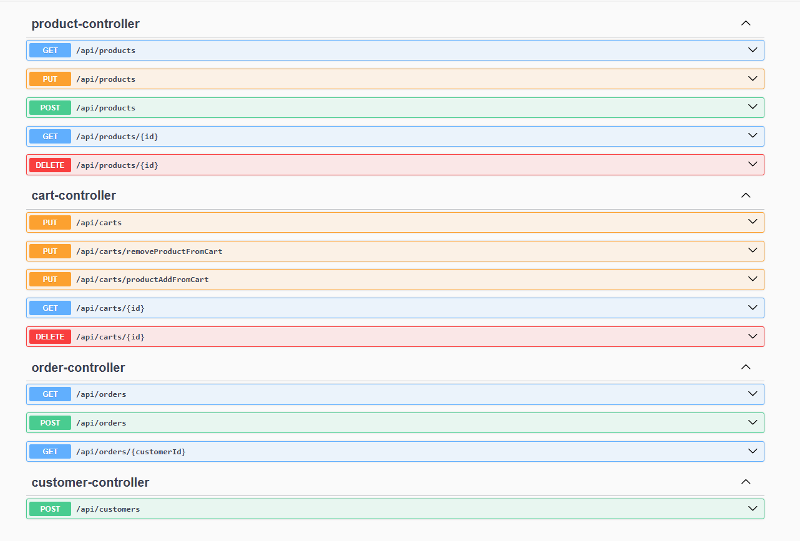
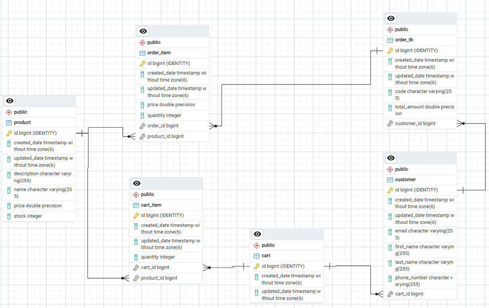

## Özellikler
* Müşteri ekleme (``POST /api/customers``)
* Ürün oluşturma (``POST /api/products``)
* Ürün detayı getirme (``GET /api/products/{id}``)
* Ürün adına göre arama (``GET /api/products?name={name}``)
* Ürün güncelleme (``PUT /api/products``)
* Ürün silme (``DELETE /api/products/{id}``)
* Sepeti getirme (``GET /api/carts/{id}``)
* Sepeti güncelleme (``PUT /api/carts``)
* Sepete ürün ekleme (``PUT /api/carts/productAddFromCart``)
* Sepetten ürün çıkarma (``PUT /api/carts/removeProductFromCart``)
* Sepeti temizleme (``DELETE /api/carts/{id}``)
* Sipariş verme (``POST /api/orders``)
* Sipariş koduna göre sipariş detayı getirme (``GET /api/orders?code={code}``)
* Müşterinin siparişlerini listeleme (``GET /api/orders/{customerId}``)
* Yeni bir müşteri eklendiği zaman müşteri için sepet otomatik olarak ekleme

## Kullanılan Teknolojiler
* Java 17
* Maven
* Spring Boot (Version : 3.3.5)
* Postqresql
* Dependencies
==> Spring Web
--  Lombok
--  Spring Data JPA
--  Swagger
## API Dokümantasyonu
* ``http://localhost:8080/swagger-ui.html``

## Veritabanı ER diagramı

